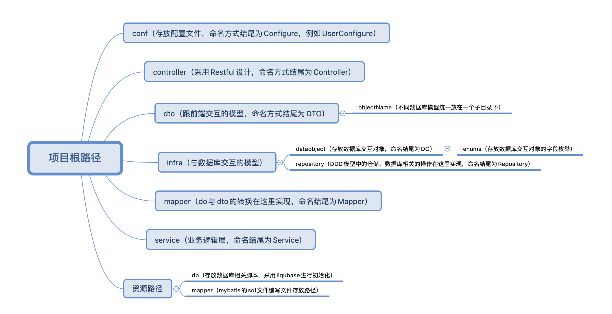

# 项目介绍

本项目基于``springboot-2.1.0``搭建的快速开发后端脚手架，项目分层采用了DDD领域驱动设计，具体项目层级如图所示：


# 快速开始
在新建的项目下引入框架包的maven相关依赖
```
<!-- 父级，springboot2.1.0封装的父级框架 -->
<parent>
    <groupId>org.dinghuang</groupId>
    <artifactId>dinghuang-framework-parent</artifactId>
    <version>0.1.0-RELEASE</version>
</parent>

<properties>
    <java.version>1.8</java.version>
    <project.build.sourceEncoding>UTF-8</project.build.sourceEncoding>
    <project.reporting.outputEncoding>UTF-8</project.reporting.outputEncoding>
    <mapstruct>1.3.0.Final</mapstruct>
    <spring-cloud-starter>1.4.7.RELEASE</spring-cloud-starter>
</properties>

<dependencies>
    <dependency>
        <groupId>org.dinghuang</groupId>
        <artifactId>dinghuang-framework-core</artifactId>
        <version>0.1.0-RELEASE</version>
        <scope>compile</scope>
    </dependency>
</dependencies>

<build>
    <plugins>
        <plugin>
            <groupId>org.apache.maven.plugins</groupId>
            <artifactId>maven-compiler-plugin</artifactId>
            <version>3.6.2</version>
            <configuration>
                <source>1.8</source>
                <target>1.8</target>
                <annotationProcessorPaths>
                    <!--这个配置是因为lombok跟mapstruct一起用的时候maven对注解的解析器选择有点问题-->
                    <path>
                        <groupId>org.mapstruct</groupId>
                        <artifactId>mapstruct-processor</artifactId>
                        <version>${mapstruct}</version>
                    </path>
                    <path>
                        <groupId>org.projectlombok</groupId>
                        <artifactId>lombok</artifactId>
                        <version>1.16.20</version>
                    </path>
                </annotationProcessorPaths>
                <compilerArgs>
                    <compilerArg>
                        -Amapstruct.defaultComponentModel=spring
                    </compilerArg>
                </compilerArgs>
            </configuration>
        </plugin>
        <plugin>
            <groupId>org.springframework.boot</groupId>
            <artifactId>spring-boot-maven-plugin</artifactId>
        </plugin>
    </plugins>
    <finalName>demo</finalName>
</build>
```
执行自动生成代码方法，目前支持mysql、oracle、postgres数据库
```
    /**
    * 自动生成代码
    * <p>
    * 例如(null,true, "aaa_asd", "asd", "哈哈", "com.dinghuang.sale.customer", "jdbc:mysql://127.0.0.1:3306/adas?useUnicode=true&characterEncoding=utf-8&useSSL=false", "root", "root")
    *
    * @param rootPath         根路径
    * @param cover            是否覆盖
    * @param tableName        表名
    * @param moduleName       模块名
    * @param tableDescription 表描述
    * @param path             项目相对路径
    * @param url              数据库url
    * @param user             数据库用户名
    * @param password         数据库密码
    */
   public static void main(String[] args) {
       CodeGeneratorUtils codeGenerateUtils = new CodeGeneratorUtils();
       codeGenerateUtils.generate("/Users/dinghuang/Documents/workSpace/huarun/spring-cloud-framework/demo",
               true, 
               "com_esb_log", 
               "esb_log", 
               "esb日志表", 
               "org.dinghuang.demo", 
               "jdbc:mysql://127.0.0.1:3306/sale_common_dev?useUnicode=true&characterEncoding=utf-8&useSSL=false", 
               "root", 
               "root");
   }
```

## 数据库脚本使用
在``application.yml``中开启配置
```
  liquibase:
    enabled: false
    changeLog: "classpath:/db/changelog/db.changelog-master.xml"
    checkChangeLogLocation: true
    #用于跟踪更改历史记录的表的名称。
    databaseChangeLogTable: DATABASECHANGELOG
    #用于跟踪Liquibase并发使用情况的表的名称。
    databaseChangeLogLockTable: DATABASECHANGELOGLOCK
    #是否先清空数据库
    dropFirst: false
    #是否应该在执行更新之前测试回滚。
    testRollbackOnUpdate: true
```
在目录``classpath:/db/changelog/initdata``编写sql文件
```
--liquibase formatted sql

--changeset dinghuang-2018-03-04-test-table-create:1
CREATE TABLE test (
ID BIGINT PRIMARY KEY NOT NULL,
NAME CHARACTER VARYING ( 19 ) NOT NULL,
SEX CHARACTER VARYING ( 19 ) NOT NULL,
OBJECT_VERSION_NUMBER BIGINT NOT NULL DEFAULT 0,
CREATED_BY CHARACTER VARYING ( 50 ) NOT NULL DEFAULT '-1',
CREATED_BY_NAME CHARACTER VARYING ( 50 ) NOT NULL DEFAULT '-1',
CREATION_DATE DATE NOT NULL DEFAULT CURRENT_TIMESTAMP,
LAST_UPDATED_BY CHARACTER VARYING ( 50 ) NOT NULL DEFAULT '-1',
LAST_UPDATED_BY_NAME CHARACTER VARYING ( 50 ) NOT NULL DEFAULT '-1',
LAST_UPDATED_DATE DATE NOT NULL DEFAULT CURRENT_TIMESTAMP
);
COMMENT ON TABLE test IS '测试对象';
COMMENT ON COLUMN test.ID IS '主键';
COMMENT ON COLUMN test.NAME IS '姓名';
COMMENT ON COLUMN test.SEX IS '性别';
COMMENT ON COLUMN test.OBJECT_VERSION_NUMBER IS '乐观锁版本号';
COMMENT ON COLUMN test.CREATED_BY IS '创建人';
COMMENT ON COLUMN test.CREATED_BY_NAME IS '创建人姓名';
COMMENT ON COLUMN test.CREATION_DATE IS '创建时间';
COMMENT ON COLUMN test.LAST_UPDATED_BY IS '最后更新人';
COMMENT ON COLUMN test.LAST_UPDATED_BY_NAME IS '最后更新人姓名';
COMMENT ON COLUMN test.LAST_UPDATED_DATE IS '最后更新时间';
--rollback DROP TABLE TEST;

--changeset dinghuang-2018-03-04-test-table-init-data:2
INSERT INTO "public"."test" ( "id", "name", "sex", "object_version_number", "created_by", "created_by_name", "creation_date", "last_updated_by", "last_updated_by_name", "last_updated_date" )
VALUES( 1, '1', '2', 1, '-1', '-1', '2020-01-16', '-1', '-1', '2020-01-16' );
--rollback DELETE from TEST where id in(1);
```
每次有新的脚本需要执行的时候，新建对应的sql文件，``--changeset``名字唯一，命名方式以``xxx-日期-表名-操作``，只会执行一次，在``--rollback``定义sql执行失败的回滚语句。

# 项目详解
## do相关
所有的do对象都继承``BaseModel``，里面包含了6个审计字段，分别为

- ``OBJECT_VERSION_NUMBER``：乐观锁实现，从0开始，所有的更新操作都得带上这个字段，更新时与数据库不一致会更新失败，所以返回查询信息给前端的时候，这个字段都要查给前端。
- ``CREATED_BY``：创建人英文名。
- ``CREATED_BY_NAME``：创建人中文名。
- ``CREATION_DATE``：创建时间。
- ``LAST_UPDATED_BY``：最后更新人英文名。
- ``LAST_UPDATED_BY_NAME``：最后更新人中文名。
- ``LAST_UPDATED_DATE``：最后更新时间。

审计制度不需要开发手动维护，``mybatisPlus``插件实现了自动的维护，但是用户信息的获取方式，需要实现``UserInfoAdapter``的``getUser``方法。

``mybatisPlus``插件默认为空的字段不更新，如果需要空的字段更新的话，需要在do对象的属性上面加上注解``@TableField(strategy = FieldStrategy.IGNORED)``，这样就能把空的更新进去，但是后续所有更新操作，这个字段都不允许空的更新进去了，每次更新得把原来的查一遍出来，以后会实现，更新的时候传参数，可以更新你选定的空的字段。

``repository``继承``BaseRepository``，有单表的常用查询方法，可以配合``QueryWrapper``使用，例如

```
QueryWrapper<TestDO> testDOQueryWrapper = new QueryWrapper<>();
testDOQueryWrapper.like(TestEnum.NAME.value(),"");
List<TestDO> testDOS = testRepository.selectList(testDOQueryWrapper);
```

### 自己实现分页
Controller
```
@GetMapping(value = "/query_by_page_customer")
@ApiOperation(value = "自定义分页查询")
public ResponseEntity<PageableDTO<TestDTO>> queryByPageCustomer(@Valid PageableSearchDTO pageableSearchDTO) {
    return new ResponseEntity<>(testService.queryByPageCustomer(pageableSearchDTO), HttpStatus.OK);
}
```
Service
```
@SuppressWarnings("unchecked")
public PageableDTO<TestDTO> queryByPageCustomer(PageableSearchDTO pageableSearchDTO) {
    String queryMessage = pageableSearchDTO.getMessage();
    //自定义的高级查询，前端把高级查询字段转成json放在message字段中，后端这里重新转成查询对象
    CustomerPageQueryDTO customerPageQueryDTO = Optional.ofNullable(JSON.parseObject(queryMessage, CustomerPageQueryDTO.class)).orElse(new CustomerPageQueryDTO());
    //例如这里是项目维度进行控制，没有传projectNum返回空的分页
    if (StringUtils.isEmpty(customerPageQueryDTO.getProjectNum()) || StringUtils.isBlank(customerPageQueryDTO.getProjectNum())) {
        return pageableSearchDTO.initEmptyPageableDto();
    } else {
        Pageable<TestDO> potentialCustomerPageDTOPageable = testRepository.queryByPage(PageableMapper.INSTANCE.searchDtoToDo(pageableSearchDTO), customerPageQueryDTO);
        return TestMapper.INSTANCE.pageDoToDto(potentialCustomerPageDTOPageable);
    }
}
```
Repository
```
Pageable<TestDO> queryByPage(Pageable page, @Param("customerPageQueryDTO") CustomerPageQueryDTO customerPageQueryDTO);
```
Mapper.xml
```
<select id="queryByPage" resultType="org.dinghuang.demo.infra.dataobject.TestDO">
        select
        *
        from test ts
        WHERE 1 = 1
        <if test="customerPageQueryDTO.customerNameOrPhone != null and customerPageQueryDTO.customerNameOrPhone != ''">
            AND (ts.name LIKE CONCAT('%',#{customerPageQueryDTO.customerNameOrPhone},'%') or cus.contact_phone LIKE
            CONCAT('%',#{customerPageQueryDTO.customerNameOrPhone},'%') or ts.certificate_no LIKE
            CONCAT('%',#{customerPageQueryDTO.customerNameOrPhone},'%'))
        </if>
        <if test="customerPageQueryDTO.customerType != null and customerPageQueryDTO.customerType != ''">
            AND ts.customer_type = #{customerPageQueryDTO.customerType}
        </if>
</select>
```

### mapper
mapper是用于做do与dto数据模型之间的转换的，好处是数据隔离的作用，确保数据安全性，mapper使用的是``mapstruct``插件，具体使用的方式可以看官方文档，这里可以举个例子，如果写了do到dto的转换，那他们之间的数组转换，只需要定义就够了：
```
/**
 * do到dto的转换
 *
 * @param testDO testDO
 * @return TestDTO
 */
TestDTO doToDto(TestDO testDO);

/**
 * do到dto列表转换
 *
 * @param testDOS testDOS
 * @return TestDTO
 */
List<TestDTO> doToDtos(List<TestDO> testDOS);
```
如果有对个别字段的操作，可以用注解``@Mapping``这个注解基本可以满足所有操作，还包括字段之间的格式转换。

## 注意事项
本项目Controller跟Web之间的数据传输使用fastjson进行转换的，spring默认的是jackson，jackson的日期注解会失效，如果需要在dto的日期增加格式的话，用fastjson的日期格式注解。

一般项目开发，遵循设计模式的思想，一般service都会有实现类，在service对应的impl目录下，命名结尾为Impl，但是对于业务逻辑的编写，多个接口实现类实际上是基本没有这个场景的，除非工具的适配器的这些写法，所以默认是不需要多写一层interface，简便开发效率。


